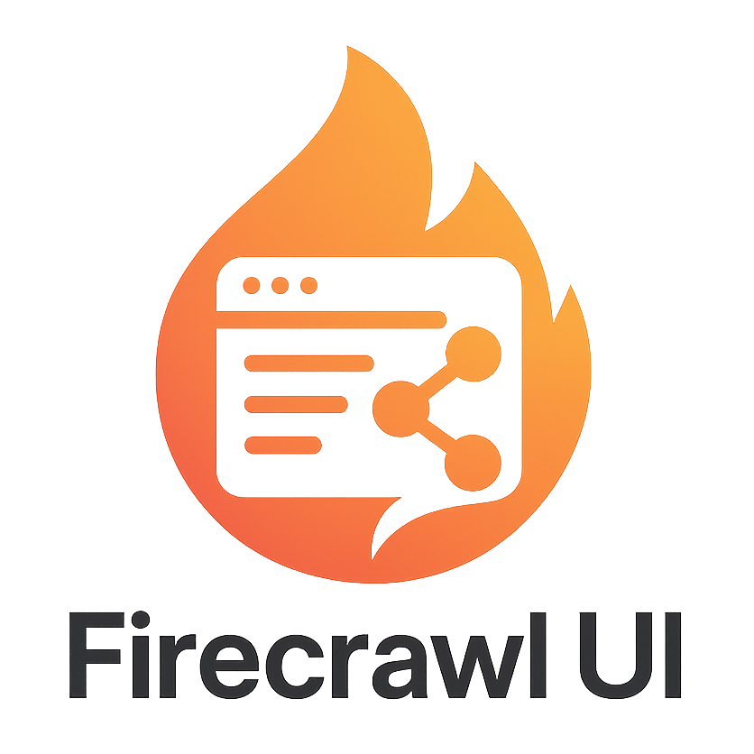
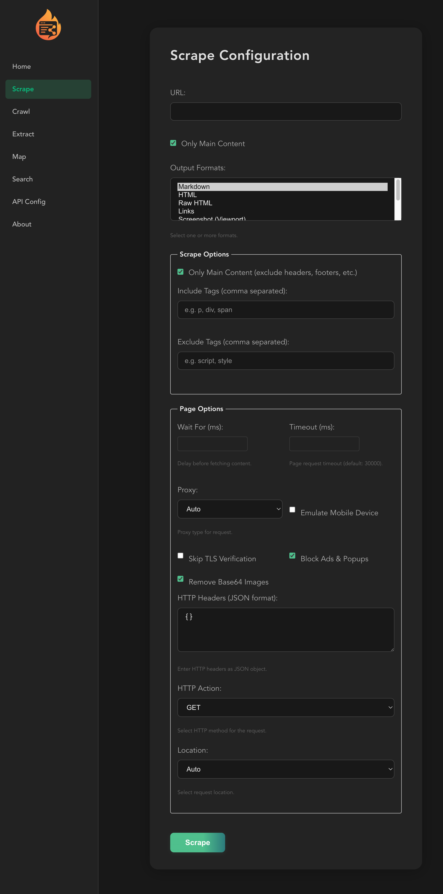

# Firecrawl UI



[](https://github.com/obeone/firecrawl-ui/blob/main/LICENSE) [](https://github.com/obeone/firecrawl-ui/actions/workflows/ci.yml)

Firecrawl UI is a Vue 3 application for interacting with the [Firecrawl API](https://firecrawl.dev/).
It allows you to scrape pages, launch crawls and extract structured data through a simple web interface.

This project aims to provide a user-friendly way to leverage the power of Firecrawl for various web scraping and data extraction tasks.

## Table of Contents

- [Firecrawl UI](#firecrawl-ui)
  - [Table of Contents](#table-of-contents)
  - [Features](#features)
  - [Quick Start](#quick-start)
  - [Environment Variables](#environment-variables)
  - [Development](#development)
  - [Production Build](#production-build)
  - [Docker](#docker)
  - [API Specification](#api-specification)
  - [Contributing](#contributing)
  - [Visuals](#visuals)

## Features

✨ Scrape individual URLs
🚀 Launch crawling jobs with custom depth
🧠 Extract data using Firecrawl's AI tools
🔑 Configure and store your API key locally
📊 View or export results

## Quick Start

The easiest way to get started is by using the hosted version:

Simply visit [https://firecrawl-ui.obeone.cloud](https://firecrawl-ui.obeone.cloud) in your browser.

Alternatively, you can run it using the prebuilt Docker image:

1. Run the container: `docker run -p 8080:8080 obeoneorg/firecrawl-ui`
2. Open your browser to `http://localhost:8080/`.
3. Configure your API key and base URL in the application settings page.

You can also run it locally:

1. Clone the repository.
2. Install dependencies: `npm install`
3. Run the development server: `npm run dev`
4. Open your browser to `http://localhost:5173/` (or the address shown in your terminal).
5. Configure your API key and base URL in the application settings page.

## Environment Variables

Environment variables are an optional way to configure API access. Alternatively, you can configure the API key and base URL directly within the application's settings page after launching.

To use environment variables, set the following:

- `VITE_FIRECRAWL_API_KEY` - your Firecrawl API key
- `VITE_FIRECRAWL_API_BASE_URL` - base URL of the Firecrawl API

You can create a `.env` file in the project root with these variables:

```sh
VITE_FIRECRAWL_API_KEY=your_api_key
VITE_FIRECRAWL_API_BASE_URL=https://api.firecrawl.dev/v1
```

These variables are read in `src/config/api.ts`.

## Development

Run the dev server with hot reload:

```sh
npm run dev
```

## Production Build

Compile and minify the application:

```sh
npm run build
```

Preview the built app locally:

```sh
npm run preview
```

## Docker

Build the Docker image:

```sh
docker build -t firecrawl-ui .
```

Run the container and expose the Nginx server:

```sh
docker run -p 8080:8080 firecrawl-ui
```

A prebuilt image is also published and can be pulled from:

- `ghcr.io/obeone/firecrawl-ui`
- `docker.io/obeoneorg/firecrawl-ui`

## API Specification

The OpenAPI document describing all endpoints is available in `openapi.yaml`.

## Contributing

Contributions are welcome. Please open an issue or submit a pull request.

## Visuals




